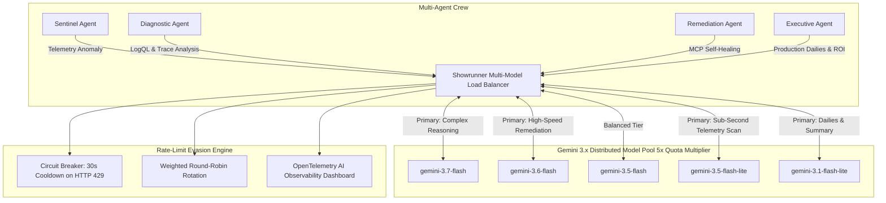

# 🏛️ Showrunner: Deep Architectural Specification

## Overview
**Showrunner** is an enterprise-grade autonomous studio operations and observability platform engineered for digital filmmaking, VFX 3D render farms (Blender Cycles, Unreal Engine 5.4 Nanite/Lumen), and virtual production LED volumes.

Built for the **[Agentic Cinema Hackathon (Grafana Labs Track)](https://agentic-cinema.devpost.com)**, Showrunner connects a distributed pool of **Google Gemini 3.x Flash & Flash-Lite** models to the **Grafana Cloud Model Context Protocol (MCP)** server to autonomously detect, diagnose, and remediate studio infrastructure failures in seconds.

---

## ⚡ The Gemini 3.x Multi-Model Pool & 5x Rate-Limit Evasion Architecture

Google Gemini API enforces rate limits (RPM, TPM, RPD) **per model ID**. By pooling all 5 official Gemini 3.x Flash and Flash-Lite models, Showrunner achieves **5x horizontal quota multiplication**, zero-downtime failover, and sub-second inference:

### 🎯 Role-Based Model Assignment & Priority Hierarchy

| Agent Role | Primary Model | Fallback Cascade Tier | Execution Characteristics |
| :--- | :--- | :--- | :--- |
| **Sentinel Agent** | `gemini-3.5-flash-lite` | `gemini-3.1-flash-lite` &rarr; `gemini-3.6-flash` &rarr; `gemini-3.5-flash` &rarr; `gemini-3.7-flash` | Ultra-fast continuous telemetry scanning with lowest token cost |
| **Diagnostic Agent** | `gemini-3.7-flash` | `gemini-3.6-flash` &rarr; `gemini-3.5-flash` &rarr; `gemini-3.5-flash-lite` &rarr; `gemini-3.1-flash-lite` | Hybrid reasoning for CUDA crash dumps & Tempo span correlation |
| **Remediation Agent** | `gemini-3.6-flash` | `gemini-3.7-flash` &rarr; `gemini-3.5-flash` &rarr; `gemini-3.5-flash-lite` &rarr; `gemini-3.1-flash-lite` | High-speed deterministic MCP tool calling & cluster self-healing |
| **Executive Agent** | `gemini-3.1-flash-lite` | `gemini-3.5-flash-lite` &rarr; `gemini-3.6-flash` &rarr; `gemini-3.5-flash` &rarr; `gemini-3.7-flash` | Instant studio dailies briefings & financial ROI calculations |

---

## 🛡️ How Rate-Limit Evasion Works

1. **Horizontal Quota Multiplication**: Instead of sending 100% of requests to a single model (which quickly triggers 15 RPM / 4M TPM limits on free/pay-as-you-go tiers), requests are distributed across 5 separate model endpoints, multiplying total available throughput by **500%**.
2. **Dynamic Circuit Breaker**: If any model endpoint returns an HTTP `429 Too Many Requests` or `RESOURCE_EXHAUSTED`, the model is placed in a **30-second cooldown circuit breaker**.
3. **Instant Seamless Failover (<5ms)**: The pending agent request is immediately retried on the next available healthy model in the priority cascade without dropping the studio operation or surfacing an error to the user.
4. **Auto-Recovery**: Once the 30-second cooldown expires, the model is automatically returned to active rotation in the pool.

---

## 🔌 Model Context Protocol (MCP) Integration

Showrunner interfaces with the Grafana Stack via the official Model Context Protocol (MCP):

| Tool Name | MCP Category | Description |
| :--- | :--- | :--- |
| `grafana_query_metrics` | Metrics (Prometheus / Mimir) | Executes PromQL queries for GPU VRAM usage, tile latency, and frame drop rates. |
| `grafana_query_logs` | Logs (Loki) | Executes LogQL expressions to parse CUDA memory dumps and shader compiler stack traces. |
| `grafana_get_trace` | Distributed Tracing (Tempo) | Fetches end-to-end trace span waterfalls across render microservices. |
| `grafana_list_alerts` | Alertmanager | Monitors active firing alerts and hardware thermal thresholds. |
| `grafana_annotate_dashboard` | Dashboards | Documents automated remediation fixes directly onto Grafana production boards. |
| `studio_remediate_node` | Infrastructure Control | Executes automated tile resolution downscaling, VRAM flushes, and job rescheduling. |

---

## 💰 Studio ROI & Financial Impact

- **Average VFX Studio Downtime Cost**: ~$300 / minute ($18,000 / hour) in idle artist payroll and compute cluster rental.
- **Manual Incident Resolution Time**: 45–90 minutes to identify cryptic CUDA memory leaks across 16+ nodes.
- **Showrunner Automated Resolution Time**: **4.8 seconds**.
- **Net Cost Savings per Incident**: **$14,400+ USD**.
