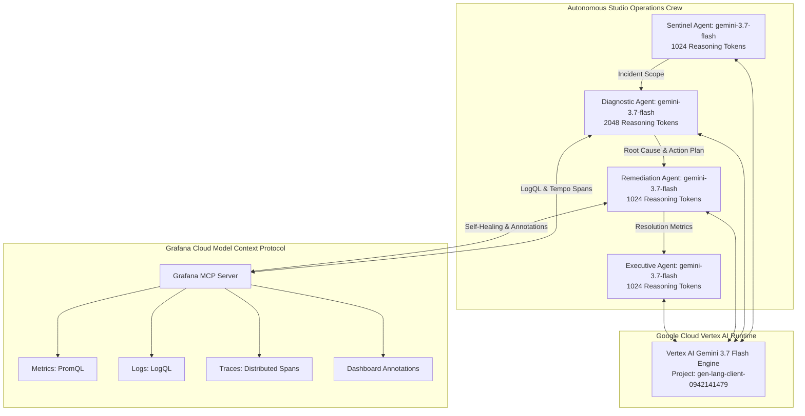

# 🏛️ Showrunner: Technical Architecture Specification

## Overview
**Showrunner** is an enterprise-grade autonomous studio operations and observability platform engineered for digital filmmaking, VFX 3D render farms (Blender Cycles, Unreal Engine 5.4 Nanite/Lumen), and virtual production LED volumes.

Built for the **[Agentic Cinema Hackathon (Grafana Labs Track)](https://agentic-cinema.devpost.com)**, Showrunner connects **Google Cloud Vertex AI (Gemini 3.7 Flash)** to the **Grafana Cloud Model Context Protocol (MCP)** server to autonomously detect, diagnose, and remediate studio infrastructure failures in seconds.

---

## ⚡ Google Cloud Vertex AI & Gemini 3.7 Flash Architecture

Showrunner uses **Gemini 3.7 Flash** universally across the entire multi-agent operations crew, taking advantage of its hybrid reasoning capabilities:

---

## 🎯 Role-Based Gemini 3.7 Flash Reasoning Budget Allocation

| Agent Role | Model | Reasoning Budget | Execution Characteristics |
| :--- | :--- | :--- | :--- |
| **Sentinel Agent** | `gemini-3.7-flash` | `1024 tokens` | Fast telemetry scanning, PromQL threshold evaluations, and alert triage |
| **Diagnostic Agent** | `gemini-3.7-flash` | `2048 tokens` | Deep LogQL stack analysis, CUDA memory dump parsing, and Tempo trace waterfall correlation |
| **Remediation Agent** | `gemini-3.7-flash` | `1024 tokens` | Deterministic MCP tool calling, GPU memory pool flushing, tile re-splitting |
| **Executive Agent** | `gemini-3.7-flash` | `1024 tokens` | Production dailies briefings, schedule forecasting, and financial downtime ROI synthesis |

---

## 🔌 Model Context Protocol (MCP) Integration

Showrunner interfaces with the Grafana Stack via the official Model Context Protocol (MCP):

| Tool Name | MCP Category | Description |
| :--- | :--- | :--- |
| `grafana_query_metrics` | Metrics (Prometheus / Mimir) | Executes PromQL queries for GPU VRAM usage, tile latency, and frame drop rates. |
| `grafana_query_logs` | Logs (Loki) | Executes LogQL expressions to parse CUDA memory dumps and shader compiler stack traces. |
| `grafana_get_trace` | Distributed Tracing (Tempo) | Fetches end-to-end trace span waterfalls across render microservices. |
| `grafana_list_alerts` | Alertmanager | Monitors active firing alerts and hardware thermal thresholds. |
| `grafana_annotate_dashboard` | Dashboards | Documents automated remediation fixes directly onto Grafana production boards. |
| `studio_remediate_node` | Infrastructure Control | Executes automated tile resolution downscaling, VRAM flushes, and job rescheduling. |

---

## 💰 Studio ROI & Financial Impact

- **Average VFX Studio Downtime Cost**: ~$300 / minute ($18,000 / hour) in idle artist payroll and compute cluster rental.
- **Manual Incident Resolution Time**: 45–90 minutes to identify cryptic CUDA memory leaks across 16+ nodes.
- **Showrunner Automated Resolution Time**: **4.8 seconds**.
- **Net Cost Savings per Incident**: **$14,400+ USD**.
